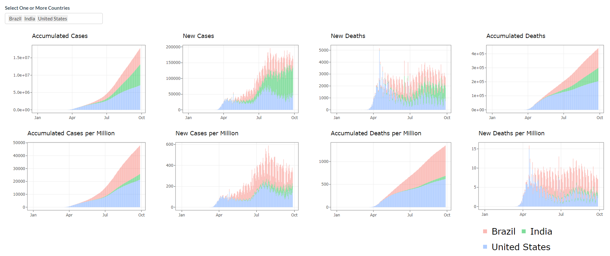

<!-- README.md is generated from README.Rmd. Please edit that file -->

```{r, include = FALSE}
knitr::opts_chunk$set(
  collapse = TRUE,
  comment = "#>",
  fig.path = "man/figures/README-",
  out.width = "100%"
)
```

# CovidShiny

<!-- badges: start -->
[](https://github.com/etc5523-2020/r-package-assessment-alangewerc/actions)
<!-- badges: end -->

This package is embedding a Shiny application dashboard about COVID-19. It was developed for an assessment of the unit “ETC5523 - Communicating with Data” of the Master of Business Analytics at Monash University.

The goal of CovidShiny is to present the user the evolution of the pandemic related to COVID-19 across the world. 
This is accomplished by a range of visualizations such as dot density map, table and stacked plots. This 
visualizations are presented in a Shiny web app. 

The user may interact with the data in a variety of forms, using sliders, action buttons and input boxes that
will define what variables will presented in each visualization. 

We create a processed dataset that can be accessed with function `covidData`. It is the same dataset but in a tidy format. The user can access the pre processed data with `preProcessedCovidData".

This package has also improved the previous Shiny application by creating new functions that improve the logic of the application, reducing the number of line of codes in the Ui and Server functions. 

Finally, diverse tests were put in place to make sure functions are working properly. To know more about this package access the following [website](https://etc5523-2020.github.io/r-package-assessment-alangewerc/). 


## Dataset

The dataset was sourced from the website [Our World in Data](https://ourworldindata.org/coronavirus/country/bolivia?country=~BOL). The website is from the organization with the same name, based on Oxford University.  

The dataset is a multivariate time-series that comprises multiple features from the period of the 31th of December, 2019 to the 29th of September of 2020. It has 40 columns with 36 features of every country. Some directly related to the Covid-19 such as the total number of deaths, total number of deaths per million habitats number of tests per day and positive rate of tests. Other data are social and economic variables that are indirectly related to covid-19 spread such as the median age of the population, GDP per capita, percentage of smokers and much more.


## Installation

And the development version from [GitHub](https://github.com/) with:

``` r
devtools::install_github("etc5523-2020/r-package-assessment-alangewerc")
```
## Example

This is a basic example which shows you how to display the application


```{example}
library(CovidShiny)
launch_app()
```


```{r external-image, echo=FALSE, out.width='100%', fig.align='left'}
# adding the figure from COVID-19 Dashboard

```


*The second page of the app - plotly*

A quick look of some variables used in the dataset for the visualisation. 

```{r, data}
str(CovidShiny::preProcessedCovidData[, 1:12])
```

